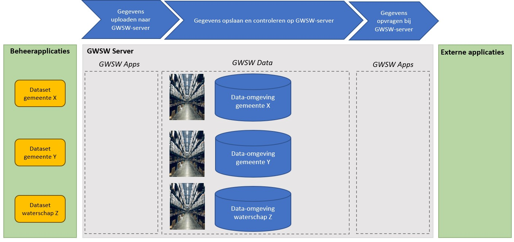
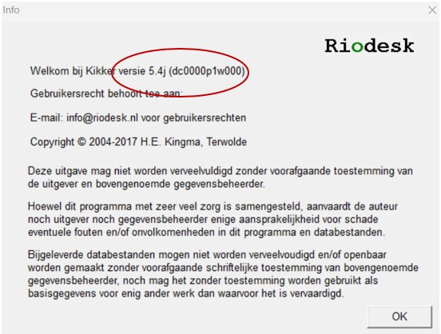
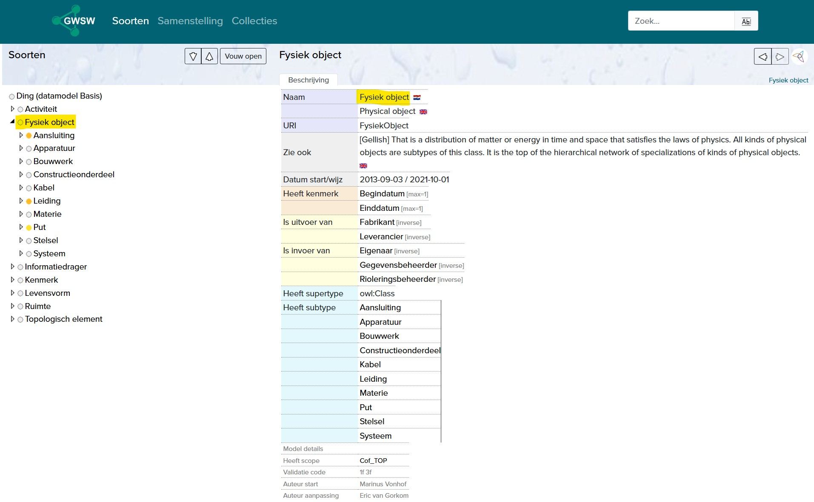
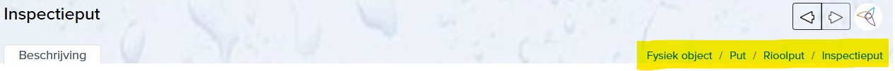
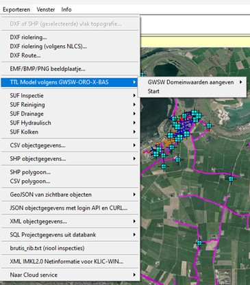
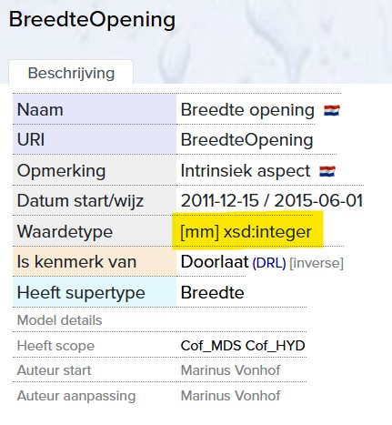

# GWSW Gebruik

Stichting RIONED is initiatiefnemer en eigenaar van dit GitHub-project, Eric Oosterom is de verantwoordelijk projectmanager. 

Vragen over deze website en het GWSW kunt u stellen via gwsw@rioned.org. 

In het GegevensWoordenboek Stedelijk Water (GWSW) worden alle objecten en gegevens van objecten, hun onderlinge relaties en de beheeractiviteiten in de riolering eenduidig gedefinieerd en vastgelegd. Dit zodat de gegevensuitwisseling eenvoudiger gaat en dat er daardoor beter beheer mogelijk is. Het GWSW geeft ons vakgebied een gezamenlijke digitale taal. 
Hieronder leggen we uit hoe je kan instappen in het GWSW, zodat je de voordelen van de standaard kan gaan gebruiken.

De inhoudsopgave aan de linkerkant van de website kan gebruikt worden als leeswijzer en ter navigatie over de pagina.

# Aanleiding

Deze pagina is in het leven geroepen om riooldatabeheerders te ondersteunen in het gebruik van het GegevensWoordenboek Stedelijk Water (GWSW). Dit willen we doen door middel van een laagdrempelig stappenplan.
Het GWSW komt ingewikkeld over en is dat ook op sommige vlakken. Als je onder de motorkap van een auto kijkt, dan komt dat ook ingewikkeld over. Het is echter niet nodig om precies te begrijpen hoe een auto helemaal werkt, om toch goed en veilig de auto te kunnen besturen. Zo werkt het ook met het GWSW.

Op de site van Stichting RIONED staat de ['waarom'](https://www.riool.net/applicaties/gegevenswoordenboek-stedelijk-water/waarom-gwsw-) beschreven. In de volgende paragraaf staat de 'hoe' van het GWSW toegelicht. De rest van de website richt zich op de 'wat' van het GWSW: Op welke manier kan een riooldatabeheerder het GWSW in haar of 
zijn dagelijke praktijk (op operationeel niveau) gebruiken. Dit proberen we te doen aan de hand van instructies per rioolobject te geven in de vorm van filmpjes, figuren of teksten. 
Hiervoor is de samenwerking met de onderstaande leveranciers van beheersoftware gezocht:

*Logo's van meewerkende leveranciers worden hier ingevoegd*

# Hoe werkt het GWSW
## Algemeen

Het GegevensWoordenboek Stedelijk Water is niets meer dan gezamenlijke afspraken over de taal, de verbanden tussen en de uitwisseling van gegevens die iets te maken hebben met het domein Stedelijk Water. Stichting RIONED heeft dit onderverdeeld in Model, Gegevens en Toepassingen.

Het Model staat op [data.gwsw.nl](https://data.gwsw.nl/) en bestaat uit:
-	Woordenboek (Ontologie): Hoe noemen we ‘iets’?
-	Datastructuur (Datamodel): Hoe zijn de verbanden of relaties tussen die ‘iets-en’?

De Gegevens staan op de GWSW-server en bestaan uit:
-	Data-omgeving per organisatie
-	In die data-omgeving staan de gegevens van die organisatie opgeslagen conform het GWSW-model

De Toepassingen (applicaties) staan op [apps.gwsw.nl](https://apps.gwsw.nl/) en bestaan uit:
-	Apps voor het uploaden van gegevens naar de GWSW-server
-	Apps voor het controleren van gegevens op de GWSW-server
-	Apps voor het opvragen van gegevens vanaf de GWSW-server

## Illustratief voorbeeld – Een distributiecentrum
Denk bij het GWSW aan een logistiek distributiecentrum van een bedrijf zoals Coolblue of BOL. Het distributiecentrum is zo ingericht dat het een logische en (daardoor) efficiënte opslag van producten is. Elk product heeft zijn eigen plek. En die plek is daar, omdat:
1)	Het een logische plek is in relatie tot ‘buur’-producten. Zo staat het witgoed en de bijbehorende aansluitslangen bij elkaar.
2)	De bereikbaarheid aansluit op de vraag van de consument. ‘Hardlopers’ zullen normaliter voor in de hal staan. Producten die zelden besteld worden, zullen verder in de hal staan.

De indeling van een distributiecentrum (Figuur 2.1) is een analogie van het GWSW-datamodel.

*Figuur 2.1 Voorbeeld van een distributiecentrum (foto door Ruchindra Gunasekara op Unsplash)*

Op de GWSW-server staat er per organisatie een ‘GWSW-conform distributiecentrum’ klaar. Dit ‘distributiecentrum’ kan worden gevuld met gegevens uit het Stedelijk Water-domein. Als deze gegevens in de stellingen van het distributiecentrum zijn opgeslagen, dan kunnen ze worden gecontroleerd (denk aan een voorraadcontrole) en weer worden uitgeleverd (denk aan een bestelling uitleveren).

## Gegevens uitwisselen via de GWSW-server
Om gebruik te kunnen maken van de voordelen van het GWSW moeten de gegevens vanuit het beheerpakket (gele blokjes aan de linkerkant) op de GWSW-server (grote grijze blok in het midden) komen te staan in de data-omgeving (het ‘distributiecentrum’) van de betreffende organisatie (blauwe cilinder). Vanuit daar kunnen de gegevens worden opgevraagd voor gebruik in externe applicaties (Figuur 2.2).

*Figuur 2.2 Beheerapplicaties (links) met de verschillende datasets (gele blokken), de GWSW-server (grijze blok in het midden) met toepassingen (GWSW Apps) en gegevensopslag (GWSW Data) in een data-omgeving per organisatie (blauwe cilinders) en externe applicaties (rechts) die gebruik maken van de gegevens op de GWSW-server*

Met GWSW Apps kunnen gegevens worden geüpload naar de GWSW-server, worden gecontroleerd en worden opgevraagd vanaf de GWSW-server.

## Gegevens uploaden naar de GWSW-server
Vanuit het beheerpakket van de gemeente wordt een uitwisselformaat geëxporteerd. Dit is een zogenoemd [GWSW-OroX bestand](https://apps.gwsw.nl/doc/GWSW.orox%20Opbouw%20dataset.pdf) en heeft als bestandsextentie *.ttl*. Dit uitwisselbestand kan via de upload-functionaliteit op [apps.gwsw.nl](https://apps.gwsw.nl/) in de data-omgeving van de betreffende gemeente op de GWSW-server worden gezet. Hiervoor is de naam van de data-omgeving en een wachtwoord (sleutel) nodig. Deze sleutel kan worden opgevraagd via gwsw@rioned.org.

De gegevens uit de kernregistratie van een waterschap worden via het GegevensKnooppunt Waterschappen naar de GWSW-server geüpload. 

## Gegevens controleren op de GWSW-server
De gegevens die in de data-omgeving op de GWSW-server staan kunnen worden gecontroleerd op basiskwaliteit en mate waarin deze voldoen aan de GWSW-standaard. Dit wordt gedaan met behulp van de toepassing [Nulmeting](https://apps.gwsw.nl/item_validate). 

Omdat voor het lezen van het resultatenbestand technische kennis van het GWSW nodig is, kan je hiervoor het beste een [GWSW-adviseur inschakelen](https://www.riool.net/applicaties/gegevenswoordenboek-stedelijk-water-gwsw/gwsw-ondersteuning-beschikbaar).

## Gegevens opvragen van de GWSW-server
De gegevens die in de data-omgeving op de GWSW-server staan kunnen worden opgevraagd voor gebruik in externe applicaties/programma’s. 
Voor het maken van hydraulische berekeningen kunnen de gegevens in [.hydx formaat worden gedownload](https://apps.gwsw.nl/item_hydxdownload). Voor andere toepassingen kunnen er diverse [Geo-formaten](https://apps.gwsw.nl/item_geo) voor verschillende thema’s worden gedownload of ontsloten.

## GWSW is in ontwikkeling
Het is goed te beseffen dat het GWSW in ontwikkeling is, voor zowel het woordenboek, het datamodel en de uitwisseling. Met elke nieuwe versie komen er nieuwe mogelijkheden voor het gebruik van de gegevens, dus ook nieuwe definities en nieuwe relaties. [De huidige versie is 1.6.1](https://www.riool.net/applicaties/gegevenswoordenboek-stedelijk-water-gwsw/huidige-versie-gwsw-en-planning/deze-gwsw-eisen-stelt-u-bij-aanschaf-van-nieuwe-software).

De adoptie van het GWSW is een groeipad voor Stichting RIONED, de leveranciers van beheer- en rekenpakketten en de gebruikers. Dit heeft logischerwijs ook gevolgen voor het gebruik.

### Randvoorwaarden
Om het gegevensbeheer, -uitwisseling en -gebruik goed aan te laten sluiten op het GWSW zijn er een aantal randvoorwaarden (met verantwoordelijkheid) van toepassing.
1)	Het beheerpakket moet in staat zijn om de gegevens op te slaan conform het GWSW (Leverancier beheerpakket) 
2)	Het beheerpakket moet gevuld zijn met gegevens die qua inhoud aansluiten op het GWSW (Riooldatabeheerder) 
3)	Het beheerpakket moet in staat zijn om de gegevens te exporteren conform het GWSW (Leverancier beheerpakket) 
4)	De GWSW-server moet in staat zijn om een correct bestand te kunnen importeren, opslaan en publiceren (Stichting RIONED) 
5)	Externe applicaties moeten in staat zijn om op basis van een export vanaf de GWSW-server de gegevens toe te passen (Leverancier externe applicatie)

Omdat het doel van voorliggende website is om riooldatabeheerders te ondersteunen in het gebruik van het GWSW, zijn de punten over het beheerpakket (punt 1 en 3) en het gegevensbeheer (punt 2) het meest relevant. Deze worden in de volgende paragraaf van de website nader toegelicht. Punt 4 en 5 worden door de leveranciers en Stichting RIONED opgepakt.

# Wat moet ik als riooldatabeheerder doen om het GWSW toe te passen in het gegevensbeheer?

## Inleiding
Om het GWSW goed te kunnen gebruiken, moet je er als riooldatabeheerder voor zorgen dat de gegevens in jouw beheerpakket zo GWSW-conform-mogelijk op de GWSW-server terecht komen.  Hiervoor ben je enerzijds afhankelijk van de mogelijkheden van jouw [**beheerpakket**](#versie_beheerpakket) (Paragraaf 3.2) en anderzijds afhankelijk van hoe jij de gegevens daarin [**registreert**](#registratie) (Paragraaf 3.3).

## Ken je beheerpakket
### Algemeen
Om de gegevens GWSW-conform op te kunnen slaan, moet het beheerpakket beschikken over velden die ook in het GWSW voorkomen of daar naartoe kunnen worden omgezet. 

Simpelweg: De stellingen in het GWSW-distributiecentrum moeten worden gevuld met de spullen die in de stellingen van het ‘beheerpakket-distributiecentrum’ staan. 

Verder moet het beheerpakket in staat zijn de informatie uit die velden zo te exporteren, zodat ze goed meekomen in het uitwisselbestand dat moet worden geüpload naar de GWSW-server ([GWSW-OroX bestand](https://apps.gwsw.nl/doc/GWSW.orox%20Opbouw%20dataset.pdf)). Wat wel in het beheerpakket staat, maar niet in de OroX terecht komt, komt namelijk ook niet op de GWSW-server terecht.

De leverancier van het beheerpakket moet duidelijkheid verschaffen over welke velden er op welke wijze gevuld moeten worden om de export naar het OroX-uitwisselbestand goed te krijgen.

### Versies en waarvoor je jouw gegevens wil gebruiken
Zoals eerder gezegd, is het [**GWSW in ontwikkeling**](#in_ontwikkeling) en zijn er met elke versie van het GWSW meer mogelijkheden. Maar niet al die mogelijkheden zijn persé voor jou relevant. Zo kan het zijn dat jij de gegevens wel wil gebruiken voor visualisatie op PDOK en hydraulische berekeningen, maar dat het maken van afvalwaterprognoses nog niet heel belangrijk voor jou is.

Daarnaast kan het zijn dat de nieuwste versie van het beheerpakket aansluit op een bepaalde versie van het GWSW, maar dat de jullie nog gebruik maken van een oudere versie van het beheerpakket, die aansluit op een oudere versie van het GWSW.

Voor jou als riooldatabeheerder is het daarom belangrijk om in beeld te hebben:
- Welke versie van het beheerpakket je hebt
- Welke versie van het GWSW jouw beheerpakket heeft
- Hoe je jouw beheerpakket kan (laten) updaten naar de nieuwste versie
- Wat zo’n update betekent voor de gegevens om te voldoen aan de (nieuwe) functionaliteiten van het beheerpakket én de GWSW-standaard

Naast de inspanningen van Stichting RIONED, zal ook de gebruiker de behoefte aan verdere implementatie van het GWSW in het beheerpakket nadrukkelijk moeten uitspreken richting de leverancier. Van de leverancier mag worden verwacht dat deze open is over wat wel én wat niet kan. Dus voor welke toepassingen jij jouw gegevens wel én niet kan gebruiken.

De applicatietoetsing – die elke twee jaar door Stichting RIONED wordt uitgevoerd – is bedoeld om de kwaliteit en consistentie van de GWSW-implementatie in softwareapplicaties te bepalen. De resultaten zijn echter een momentopname en gericht op de nieuwste versie van de software. In de eerste helft van 2025 staat de applicatietoetsing gepland.

### Welke versie heeft mijn beheerpakket?
Hieronder staat per beheerpakket hoe je in beeld kan krijgen welke versies van toepassing zijn. Dit zegt helaas niets over hoe goed de betreffende OroX is en voor welke toepassingen die dan geschikt is. Die informatie komt wel uit de Applicatietoetsing naar voren.

Lijst van beheerpakketten:
- [Brutis/Kikker](#brutis_versie)
- [GBI](#gbi_versie)
- [Geovisia](#geovisia_versie)
- [Gisib](#gisib_versie)
- [Riogl/Obsurv](#riogl_versie)

Mocht jouw beheerpakket ontbreken in dit overzicht, neem dan contact op met gwsw@rioned.org

**Brutis / Kikker (Riodesk)**

Opvragen versie van beheerpakket: Menubalk > Info > Infovenster (zie Figuur 3.1)

*Figuur 3.1 Infovenster Kikker met daarin rood omcirkeld de versie*

In Tabel 3.1 staat opgenomen welke versie Brutis/Kikker welke versie van het GWSW bevat.

*Tabel 3.1 Versie Kikker en aansluiting op GWSW-versie* 

| Versie Kikker | Versie GWSW |
|---------------|-------------|
| 5.4           | 1.5         |
| 5.3           | 1.5         |
| 4.0           | 1.4         |
| 3.6           | 1.4         |

Neem contact op met info@riodesk.nl om informatie te ontvangen over het updaten naar de nieuwste versie van BRUTIS / Kikker.

**GBI (Antea group)**

pm

**Geovisia (Dataquint)**

pm

**Gisib (Gisib BV)**

pm

**Rio GL / Obsurv (Sweco)**

pm

## Zet jouw gegevens goed en GWSW-conform in het beheerpakket
### Inleiding
Gegevens kunnen enkel uitgewisseld worden, als deze (goed) in het beheerpakket staan. Bestaat een veld niet in het ‘distributiecentrum’ (datamodel) van het beheerpakket, dan kan deze ook niet worden ingevuld door de gebruiker. Hierover ging de [vorige paragraaf](#versie_beheerpakket) (Paragraaf 3.2). 

Is een veld leeg, dan zal dit veld ook als ‘leeg’ worden meegenomen in de uitwisseling. Is een veld ingevuld met een ‘foute’ waarde (bijv. 999 wat vaak gebruikt wordt voor ‘onbekend’), dan zal dit veld ook als waarde ‘999’ worden meegenomen in de uitwisseling. Andere voorbeelden van ‘foute’ waarden zijn fouten door de eenheid (opslaan in millimeter, terwijl het pakket dat veld registreert in de eenheid meter) of door foute of onvolledige naamgeving (‘put’ in plaats van ‘inspectieput’). Kortom de **volledigheid** en **kwaliteit** van de geregistreerde gegevens moeten voldoende zijn om het gewenste resultaat te krijgen. De exportfunctionaliteit van het beheerpakket naar het OroX-exportbestand voert geen controles of correcties uit op de te exporteren gegevens.

Daarnaast is het vaak zo dat de stelselgegevens in het beheerpakket zitten maar dat kunstwerken op een andere manier worden geregistreerd, zoals in GIS, excelbestanden, telemetriesysteem of gemalenbeheerprogramma’s. De (gegevens van) objecten die niet in het (stelsel-)beheerpakket zitten, komen dus ook niet met de export uit het beheerpakket mee. Helaas is het zo dat die andere registraties (nog) niet zijn aangesloten op het GWSW. Dus ook vanuit die registraties kunnen de gegevens niet GWSW-conform worden uitgewisseld.

Dus wat kan jij, als riooldatabeheerder, doen om het gegevensbeheer in het beheerpakket zo doelmatig mogelijk in te richten, waarmee de gegevens aansluiten op het GWSW? Hiervoor hebben we een werkwijze voorzien van een stappenplan beschikbaar, waarmee jij kan bepalen op welke manier jij te werk wil gaan.

## Werkwijze om de rioleringsgegevens aan te passen aan het GWSW
### Stapsgewijs met een plan
Het is verstandig om rioleringsgegevens stapsgewijs (iteratief) aan te passen aan het GWSW. De belangrijkste en eerste stap in de verbetering van de rioleringsgegevens moet 1) het aansluiten op de [terminologie](#stap1) van het GWSW zijn. Daarna kunnen de verbeteringen eventueel verder worden gebracht door 2) de resultaten van de GWSW-nulmeting qua [plausibiliteit](#stap2) (bandbreedte van ingevulde waardes) te verwerken. Ook kan worden overwogen om van [kunstwerken](#stap3) bepaalde objectinformatie wel mee te nemen in het beheerpakket (Stap 3). Een laatste stap kan zijn om 4) de [schematisatie](#stap4) van de gegevens in het beheerpakket geschikt te maken voor volledige uitwisseling ten behoeve van bijvoorbeeld hydraulisch modelleren en het opstellen van afvalwaterprognoses. Dit is in de meeste beheerpakketten nog lastig.

In het kader van de behapbaarheid en toepasbaarheid van het eindresultaat, wordt er nu met name ingegaan op [Stap 1 Terminologie](#stap1) en [Stap 2 Plausibiliteit](#stap). Deze bestaan ook weer uit kleine stapjes. Zie [Paragraaf 4](#par4) voor wat hiermee moet worden gedaan.

### Blokmutaties
Elk object waarin een wijziging moet worden doorgevoerd, kan in het beheerpakket worden open geklikt, waarna in het nieuwe venster de wijziging kan worden doorgevoerd. Indien er veel mutaties nodig zijn, is dit echter een tijdrovende klus. 

Een efficiënter alternatief is het uitvoeren van ‘blokmutaties’. Dit zijn mutaties die uitgevoerd worden op een hele groep (‘blok’) objecten tegelijkertijd. Hierbij geeft de gebruiker aan op welke objecten de mutatie moet worden uitgevoerd, en welke mutatie dit betreft (“Voor al deze objecten moet de typologie ‘Inspectieput’ zijn”). Blokmutaties kunnen in elk beheerpakket worden uitgevoerd.

### Back up/werkomgeving/zandbak/testomgeving
Alvorens aan de slag te gaan met het uitvoeren van (grootschalige) mutaties van de gegevens in het beheerpakket, is het belangrijk om na te denken over hoe terug te keren naar een goed bestand wanneer er fouten door (foutieve) mutaties ontstaan. Het is verstandig om (tenminste) twee omgevingen te hebben: Eentje met de correcte data en eentje waarin de mutaties gedaan worden. 

Dit kan zijn: 
- Een back up maken van de correcte data (Back up 1) en op het basisbestand (Basisbestand 1) de mutaties uit te voeren. Als de mutaties positief zijn gevalideerd, dan is het mutatiebestand het basisbestand (Basisbestand 2) voor de volgende ronde en kan back up 1 in principe worden verwijderd. Van Basisbestand 2 wordt dan weer een back up gemaakt (Back up 2) en op Basisbestand 2 worden weer mutaties uitgevoerd, waardoor Basisbestand 3 ontstaat.
- De correcte data blijven gebruiken als basisbestand gedurende de mutaties. Daarnaast wordt er een kopie gemaakt van dit basisbestand. De kopie wordt neergezet in een werkomgeving/testomgeving (ook wel een ‘zandbak’ genoemd). In deze omgeving worden alle mutaties uitgevoerd en indien gewenst tussentijds gevalideerd of geback-upt. Na het uitvoeren van alle mutaties wordt dit werkbestand het basisbestand.

### Zelf of laten doen
Iedereen die weet hoe hij of zij mutaties kan doorvoeren in het beheerpakket, kan in principe de wijzigingen voor Stap 1 en 2 verwerken. In de praktijk zal het, ondanks blokmutaties, toch wel tijd en focus vragen. Daarom komt het ook voor dat hiervoor een externe partij wordt ingeschakeld.

### Wat te doen bij ontbrekende gegevens
Als de in te vullen waarden niet bekend is dan kan ervoor gekozen worden om 1) een aanname te doen, 2) veld leeg te laten, 3) veld in te vullen met ‘Onbekend’. Dit is een keuze aan de beheerder, maar de keuze moet wel consistent over de hele dataset worden uitgevoerd. Uiteraard moet bij een volgende reinigings- en inspectieronde de informatie wel in het veld worden opgenomen. Of er kan voor gekozen worden een specifieke inmeting te doen van dat object of kenmerk.

### GWSW-Nulmeting
Een GWSW-nulmeting is een krachtig, maar niet noodzakelijk middel om je op weg te helpen. De uitkomsten van een GWSW-Nulmeting kunnen je namelijk helpen inzicht te krijgen in een belangrijk deel van de ‘GWSW-fouten’ in jouw dataset. Daarnaast kan je met een tussentijdse Nulmeting de voortgang van jouw data-op-orde-project in beeld brengen en de focus daarvan bijsturen. 

### Maak een Plan van Aanpak
Stel op basis van bovenstaande punten een Plan van Aanpak op met daarin:
- De gekozen werkwijze en de onderbouwing daarvan
  - Back-up
  - Zelf of laten doen
  - Volgorde en focus (of methode om dat te bepalen)
- Planning
  - Tijdspad
  - Monitoring van tussenresultaten
- Raming
  - Kosten
  - Tijd

Regel op basis van dit Plan van Aanpak het benodigde budget/tijd.

# Stappenplan
In onderstaand stappenplan staat beschreven op welke wijze de terminologie (stap 1) en plausibiliteit van de gegevens (stap 2) kan worden verbeterd. Hier voorafgaand wordt in stap 0 een toelichting gegeven op het datamodel (de inrichting van het distributiecentrum).
Dit proberen we te doen aan de hand van instructies per rioolobject in de vorm van filmpjes, figuren en teksten. Hiervoor is de samenwerking met de onderstaande leveranciers van beheersoftware gezocht. De volgende partijen werken daaraan mee:

*Logo’s van meewerkende leveranciers worden hier ingevoegd* 

## Stap 0: Begrijp het GWSW-datamodel een beetje
Het GegevensWoordenboek Stedelijk Water is [online](https://data.gwsw.nl/1.6.1/Totaal/index.html?menu_item=classes) te vinden. Aan de linkerkant zit een boomstructuur, waarbij Fysiek Object relevant is voor de gegevens in het beheerpakket (Figuur 4.1). 

*Figuur 4.1 GWSW structuur op data.gwsw.nl*

Alle termen (concepten genoemd) die onder die tak zitten, zijn de officiële termen die in het GWSW zitten. Door op een term te klikken, kom je in het overzichtsveld van die term uit, waarin vaak een definitie en/of synoniem en/of afbeelding is opgenomen van die term. Let op: Navigeren doe je via de soortenboom of het broodkruimelpad (Figuur 4.2) en niet via de pagina-terug-knop van de browser.

*Figuur 4.2 Broodkruimelpad*

Je kunt kiezen uit ‘de smaken’ van de soortenboom als je de terminologie gaat verbeteren. Let wel: Niet alles wat in de soortenboom zit, ‘moet’ in jouw gegevens te zitten. Maar als het erin zit, moet je het wel zo noemen in de export naar de GWSW-server.

### Mapping in de beheersoftware
Sommige beheersoftware biedt de mogelijkheid aan om naamgeving te koppelen aan GWSW concepten.

In **Brutis** kan er een mapping worden aangemaakt waarin de koppeling wordt gelegd tussen de huidige naamgeving (in Brutis) en hoe het meegegeven moet worden in de export naar de GWSW-server (Figuur 4.3). Vanuit het principe ‘data bij de bron beheren’ is het advies om de objecten GWSW-conform te noemen in het beheerpakket.

*Figuur 4.3 Mogelijkheid tot het aangeven van GWSW Domeinwaarden als 'mapping' tussen Brutis en het GWSW*

## Stap 1: Verbeter de terminologie
De terminologie van het GWSW moet exact zo worden geïmporteerd naar de GWSW-server. Typfouten of een andere schrijfwijze ‘snapt’ de GWSW-server niet. Als voorbeeld: “Mof_spie” is fout. Het moet zijn “Mof/Spie”. De meeste beheerpakketten hebben hier voorgedefinieerde keuzelijsten voor.

### Putten
**Typologie put**
In het GWSW moet een put tot op een bepaald niveau worden getypeerd. Hoe dieper in de GWSW-boom, hoe beter. Hieronder staat tot welk niveau dit in <ins>ieder geval</ins> moet gebeuren, dieper mag altijd.

*Tabel 4.1 Typologie put* 
|---------------------------|-------------------------|
| Beerput                   | Kruisingsput            |
| Blinde put                | Lozingsput              |
| Infiltratieput            | Externe overstortput    |
| Kolk                      | Interne overstortput    |
| Bijzondere putconstructie | Verbeterde overstortput |
| Doorspoelput              | Pompput                 |
| Doorspuitput              | Pompunit                |
| Inspectieput              | Stuwput                 |

Van een overstortput moet dus altijd aangegeven worden of het om een “Externe overstortput”, “Interne overstortput” of “Verbeterde overstortput” gaat.
Een pompput is een rioolput bestemd voor het verpompen van afvalwater. Een pompunit is daar een variant op. Dit is namelijk een pompput bestemd voor het verpompen van afvalwater in een drukrioleringsstelsel.

**Materiaal put**
Een put kan bestaan uit de volgende materialen:
PM

**Vorm put**
Een put kan de volgende vorm hebben:
PM

**Maaiveldschematisering**
Van een put moet worden opgenomen hoe deze kan uitwisselen met het maaiveld. Uit de volgende waarden kan je kiezen:
PM

### Leidingen
**Typologie leidingen**
In het GWSW moet een leiding tot op een bepaald niveau worden getypeerd. Hoe dieper in de GWSW-boom, hoe beter. Hieronder staat tot welk niveau dit in <ins>ieder geval</ins> moet gebeuren, dieper mag altijd. De onderstaande termen/niveaus zijn zeker goed voor leiding.
PM

De leidingen die nu zijn voorzien van de typologie ‘Vrijverval rioolleiding’ of ‘Mechanische rioolleiding’, zullen dus nog verder moeten worden getypeerd.

**Materiaal leiding**
Een leiding kan bestaan uit de volgende materialen:
PM

**Vorm leiding**
Een leiding kan de volgende vorm hebben:
PM

## Stap 2: Verbeter de gegevenskwaliteit
### Datatype
De meeste getallen in het GWSW moeten worden opgegeven als een ‘Integer’ waardetype. Dat betekent een getal zonder decimalen met een bepaalde eenheid (bijvoorbeeld mm). Niveaus worden doorgaans met decimalen in m NAP vastgelegd. Deze informatie staat vermeld op de GWSW-website bij de het Waardetype van de term (Figuur 4.4).

*Figuur 4.4 Voorbeeld van hoe waardetype van een GWSW-term staat beschreven*

Als er een getal met komma’s in het veld staat ingevuld waar het waardetype ‘Integer’ is, ga dan na wat de eenheid is.

### Putten
**Afmetingen van een put**
Van een put moet de lengte, breedte (of diameter) en inwendige hoogte worden opgegeven. Let hierbij op de eenheid (mm zonder decimalen).

De lengte en breedte van een put moet tussen de 300 en 4.000 mm liggen, anders wordt deze ‘geflagged’ door de GWSW-nulmeting. De inwendige hoogte van een put moet tussen de 500 en 4.000 mm liggen.

Sorteer op lengte en kijk welke putten er een waarde hebben van <300 mm en > 4.000 mm. Bepaal of de afwijkende afmetingen logisch zijn, bijvoorbeeld bij bijzondere constructies, of pas aan. Doe hetzelfde voor breedte. Controleer zo ook de hoogte van een put.

### Leidingen
**Afmetingen van een leiding**
Van een leiding moet de lengte, breedte (of diameter) en hoogte worden opgegeven. Let hierbij op de eenheid (lengte in m met decimalen, breedte/hoogte/diameter in mm zonder decimalen).

De lengte van een vrijverval leiding moet tussen de 1 en 75 meter liggen, anders wordt deze ‘geflagged’ door de GWSW-nulmeting. De hoogte/breedte/diameter van een leiding moet tussen de 63 en 4.000 mm liggen.

Werkwijze is hetzelfde als bij de putten. Bepaal voor welke objecten dit geldt, en pas, na beoordeling, de waarde aan. Afwijkingen zijn vaak te zien bij bergbezinkbassins en infiltratiekratten.

**Diepteligging van een leiding**
Van een leiding moet ook de binnen onderkant buis (BOB, als niveau t.o.v. NAP) worden opgegeven voor het beginpunt en het eindpunt van de leiding.

